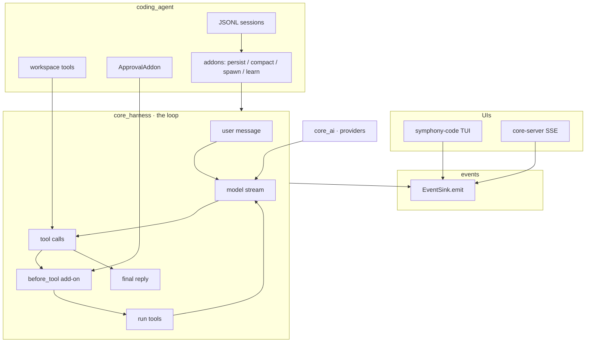

# Symphony

An agent harness, MIT licensed. Keep the loop product-agnostic, keep providers
swappable, and drive every UI from a single control-plane event stream.

<p>
  <a href="./docs/getting-started/installation.md"><strong>Install</strong></a>
  ·
  <a href="./docs/getting-started/quickstart.md"><strong>Quickstart</strong></a>
  ·
  <a href="./docs/README.md"><strong>Docs</strong></a>
  ·
  <a href="https://github.com/Sarthakischauhan/symphony">GitHub</a>
</p>

```sh
git clone https://github.com/Sarthakischauhan/symphony.git
cd symphony
uv sync
uv run --package symphony-code symphony   # asks for a provider + API key if none is set
# or: export OPENAI_API_KEY=sk-... then launch
```

## Names

The repository is **Symphony**. It is a [uv](https://docs.astral.sh/uv/)
workspace of four packages; three are published to PyPI. The PyPI names, the
Python import names, and the command names are all different on purpose, and
this table is the one place they are all listed:

| Directory | PyPI distribution | Python import | Command(s) |
| --- | --- | --- | --- |
| `core_ai/` | `symphony-core` | `core_ai` | — |
| `core_harness/` | `symphony-harness` | `core_harness` | — |
| `coding_agent/` | `symphony-code` | `coding_agent` | `symphony` (aliases: `symphony-code`, `coding-agent-tui`) |
| `core_server/` | `core-server` (not published; workspace only) | `core_server` | `core-server` |

---

## What it is

Symphony is the harness. Agents are separate consumers that plug into it.

It is not a copilot bolted to an IDE, and it is not a wrapper around a single
API. A turn is model stream → tool calls → authorize and run → back to the
model, with every UI reading the same typed events. Parent runs can spawn
children; those children reuse the stream, tagged with `parent_id` and
`agent_id`.

`symphony-code` is the first product on the harness (workspace tools, JSONL
sessions, Textual TUI). A browser-use agent is next.

<video src="./docs/demo.mp4" controls muted loop playsinline poster="./docs/demo.png" width="800">
  <a href="./docs/demo.mp4">Demo: symphony-code writes hello.py, a test, and runs pytest</a>
</video>



| Layer | Package | Role |
| --- | --- | --- |
| Harness | [`symphony-harness`](./core_harness/README.md) | Turns, tools, control-plane events, compaction |
| Harness | [`symphony-core`](./core_ai/README.md) | OpenAI, Anthropic, Gemini, Grok; catalog; streaming types |
| Agent | [`symphony-code`](./coding_agent/README.md) | Workspace tools, JSONL sessions, Textual TUI |
| Server | [`core-server`](./core_server/README.md) | FastAPI wrapper that streams those events over SSE |

---

## Install

**Requirements:** Python ≥ 3.11 and [uv](https://docs.astral.sh/uv/). At least
one provider key. If none is set, the TUI asks which provider to use.


### From source (TUI + all packages)

```sh
git clone https://github.com/Sarthakischauhan/symphony.git
cd symphony
uv sync
uv run --package symphony-code symphony
```

If no key is set, the TUI asks which provider to use. You can still export one
yourself (`OPENAI_API_KEY`, `ANTHROPIC_API_KEY`, `GEMINI_API_KEY`, or `XAI_API_KEY`).

`symphony`, `symphony-code`, and `coding-agent-tui` are the same entry point.

### As libraries

GitHub Releases publish wheels to PyPI.

```sh
uv add symphony-core
uv add symphony-harness
uv add symphony-code
```

```sh
pip install symphony-core symphony-harness symphony-code
```

| Package | Import | Install for |
| --- | --- | --- |
| [`symphony-core`](./core_ai/README.md) | `core_ai` | Providers, catalog, `Message` / `StreamEvent` |
| [`symphony-harness`](./core_harness/README.md) | `core_harness` | Agent loop, tools, control plane, compaction |
| [`symphony-code`](./coding_agent/README.md) | `coding_agent` | Workspace tools + Textual TUI |
| [`core-server`](./core_server/README.md) | `core_server` | FastAPI SSE of harness events (workspace) |

Full steps: **[Installation](./docs/getting-started/installation.md)**.

---

## Quick start

Launch against a project, pick a model, or resume:

```sh
uv run --package symphony-code symphony --workspace /path/to/project
uv run --package symphony-code symphony --model anthropic:claude-sonnet-5
uv run --package symphony-code symphony --resume
```

Then, in the TUI:

- Type `/` for slash commands. `/model` lists the generated catalog for
  providers that have credentials.
- `Tab` toggles **build** vs **plan**. Plan mode writes `.symphony/plans/`.
- `@` after whitespace inserts a workspace path.
- `Esc` cancels the in-flight run.

First conversation walkthrough: **[Quickstart](./docs/getting-started/quickstart.md)**.

The same loop as a library:

```python
from core_ai import build_default_registry, default_model_id
from coding_agent import CodingAgent

registry = build_default_registry()
agent = CodingAgent(
    registry=registry,
    model_id=default_model_id(registry),
    workspace=".",
)
result = await agent.run("Create hello.txt with hi, then read it back.")
print(result.output_text)
```

Harness-only, no coding-agent assumptions:

```python
from core_ai import build_default_registry, default_model_id
from core_harness import CoreHarness, Tool

def read_file(path: str) -> str:
    with open(path, "r", encoding="utf-8") as f:
        return f.read()

registry = build_default_registry()
harness = CoreHarness(
    registry=registry,
    model_id=default_model_id(registry),
    system_prompt="You are a concise coding assistant.",
    tools=[Tool(read_file)],
)
result = await harness.run("Inspect README.md and summarize it.")
print(result.output_text)
```

---

## Features

| | |
| --- | --- |
| **Streaming providers** | OpenAI Responses / Chat Completions, Anthropic Messages, Gemini generateContent, and Grok Chat Completions share `Message` / `StreamEvent`. Credentials register automatically. Models are `provider:model`. |
| **Generated catalog** | A checked-in snapshot of tool-calling text models (`core_ai/models/generated.py`), generated from [models.dev](https://models.dev) by a maintainer script. Installing or building the package never refreshes it. |
| **Turn-based harness** | Multi-turn tool calls, schema generation, run caps (turns, tools, runtime, tokens). |
| **Events** | `EventSink.emit` for UIs. The harness stamps `run_id`, `session_id`, seq, timestamp, schema version. Persistence and compaction are add-ons. Approval is a product `before_tool` add-on. Cancel the run task to stop a run. |
| **Coding agent** | `read_file`, `write_file`, `generate_image`, `patch`, `search`, `bash`, `ask_user`, `spawn_agent`. `@file` search, streamed bash, approval prompts, Textual TUI, 900-token-capped learning with a two-line **summary so far**. |
| **Context** | Warn thresholds, token estimates, pluggable compaction that keeps the system prompt, original task, and recent turns. |
| **Persistence** | `Persistence` protocol with checkpoints; JSONL sessions for TUI resume. |
| **SSE server** | FastAPI wrapper that forwards harness events unchanged. |

Relative paths start at the working directory; absolute and `~` paths are
allowed. `bash` runs with your user's permissions after an approval prompt.
There is no path jail or container sandbox. See [SECURITY.md](./SECURITY.md).

---

## Documentation

All package docs live under **[`docs/`](./docs/README.md)**:

| Section | What's covered |
| --- | --- |
| [Installation](./docs/getting-started/installation.md) | Source install, library install, provider keys |
| [Quickstart](./docs/getting-started/quickstart.md) | First TUI conversation, then a library run |
| [symphony-core](./docs/packages/symphony-core.md) | Providers, catalog, streaming types |
| [symphony-harness](./docs/packages/symphony-harness.md) | Loop, tools, events, limits, subagents |
| [symphony-code](./docs/packages/symphony-code.md) | Workspace agent and TUI |
| [core-server](./docs/packages/core-server.md) | FastAPI + SSE |
| [TUI](./docs/user-guide/tui.md) | Composer, modes, keybindings, images |
| [Configuration](./docs/user-guide/configuration.md) | `~/.symphony/config.json`, approvals, context |
| [Tools](./docs/user-guide/tools.md) | Workspace tool surface |
| [Learning](./docs/user-guide/learning.md) | Post-run reflection |
| [Sessions](./docs/user-guide/sessions.md) | JSONL resume |
| [Architecture](./docs/developer-guide/architecture.md) | How the four packages fit |
| [Changelog](./CHANGELOG.md) | 0.1.0 first-release notes |
| [Events](./docs/developer-guide/events.md) | Control-plane catalog |
| [CLI](./docs/reference/cli.md) | Flags for `symphony` and `core-server` |
| [Environment](./docs/reference/environment.md) | Keys, models, base URLs |
| [Slash commands](./docs/reference/slash-commands.md) | Every TUI command |

---

## Development

Requires Python ≥ 3.11 and [`uv`](https://docs.astral.sh/uv/).

```sh
uv sync                    # installs all four workspace packages + dev tools
uv run pytest              # all test suites
uv run ruff check .        # lint (same rules as CI)
uv run --package symphony-code symphony
```

CI runs lint, tests, and a build of the three published packages on every
pull request (`.github/workflows/ci.yml`). Releases publish to PyPI from
GitHub Releases (`.github/workflows/publish.yml`).

Each package has its own `README.md`, `pyproject.toml`, and tests. The stack is
**0.1.0**. See [`CHANGELOG.md`](./CHANGELOG.md) for the first-release notes,
[`plan.md`](./plan.md) for what exists today and what is next, and
[`AGENTS.md`](./AGENTS.md) for conventions when working in this repo.

## License

MIT — see [LICENSE](./LICENSE). Security reports: [SECURITY.md](./SECURITY.md).
