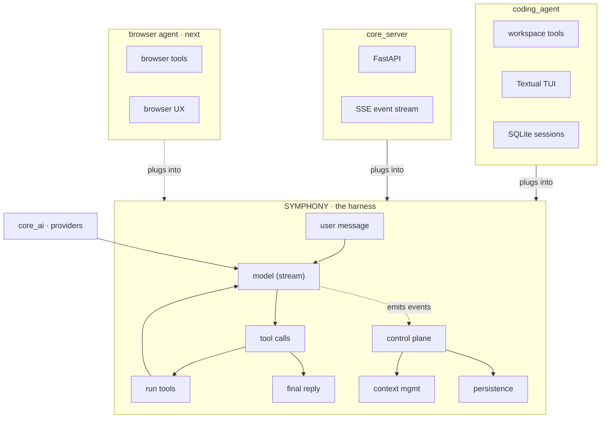

# Symphony

An open-source agent harness. `core_ai` and `core_harness` are the harness; `coding_agent` is the first product built on it — more are coming (a browser-use agent is next).

Built with a simple philosophy: keep the harness product-agnostic, keep the provider layer swappable, and drive every UI from a single control-plane event stream instead of scraping output.

## Architecture

Symphony is the harness. Agents are separate consumers that plug into it.



---

| Layer | Package | Role |
|---|---|---|
| Harness | [`core_harness`](./core_harness/README.md) | The agent loop: turns, tools, control-plane events, compaction |
| Harness | [`core_ai`](./core_ai/README.md) | OpenAI, Anthropic, and Gemini providers; model catalog; streaming types |
| Agent | [`coding_agent`](./coding_agent/README.md) | One consumer of the harness: workspace tools, SQLite sessions, Textual TUI |
| Server | [`core_server`](./core_server/README.md) | FastAPI wrapper that streams harness control-plane events over SSE |

The harness (Symphony) is standalone and product-agnostic. Agents are separate consumers that plug into the harness's tool and control-plane interfaces — `coding_agent` today, a browser-use agent next. `core_harness` builds on `core_ai`; agents do not extend the harness.

## Features

- **Streaming provider layer** — OpenAI Responses / Chat Completions, Anthropic Messages, and Gemini generateContent all stream through the same `Message` / `StreamEvent` contract. Available credentials can be registered automatically and models are addressed as `provider:model`.
- **Model catalog** — a generated, package-shipped catalog records each model's provider and API family. Builds refresh it from provider model endpoints when credentials are available and retain the checked-in snapshot otherwise.
- **Turn-based harness** — multi-turn tool calls, tool schema generation, and a typed control-plane event stream (thinking, `text_delta`, tool calls, usage, context). Every event carries `run_id`, `session_id`, a sequence number, timestamp, and schema version. Runs can cap turns, tool calls, runtime, and tokens.
- **Control plane** — every UI subscribes to the same emit stream; supports fan-out, event logs, and inbound pause/cancel commands. Cancel stops the active model stream and tool execution, then persists `run_cancelled`.
- **Coding agent** — workspace tools (`read_file`, `write_file`, `patch`, `search`, `bash`), `@file` composer search, streamed/capped bash, approval prompts before bash/overwrite/broad patch, a Textual TUI (Esc cancels), safer run limits, and 900-token-capped learning.
- **Context management** — warn thresholds, token estimation, and pluggable compaction.
- **Persistence** — a `Persistence` protocol with checkpoints, plus a SQLite store for conversation resume across runs.
- **Browser-use agent (upcoming)** — same harness, browser tools and UX on top.

## Quick Start

Set at least one provider credential, then launch the TUI:

```sh
export OPENAI_API_KEY=...       # or ANTHROPIC_API_KEY / GEMINI_API_KEY
uv run --package coding-agent coding-agent-tui
```

Select a model explicitly with a qualified id when needed:

```sh
uv run --package coding-agent coding-agent-tui \
  --model anthropic:claude-sonnet-5
```

Launch against a different workspace:

```sh
uv run --package coding-agent coding-agent-tui --workspace /tmp/coding-agent-workspace
```

Learning is enabled by default. Disable it when needed:

```sh
uv run --package coding-agent coding-agent-tui --no-learning
```

Resume a previous session interactively:

```sh
uv run --package coding-agent coding-agent-tui --resume
```

The default workspace is the current directory. Use `--workspace` to override it.

## Example

The current reference product on the harness is the coding agent:

```python
from core_ai import build_default_registry, default_model_id
from coding_agent import CodingAgent

registry = build_default_registry()

agent = CodingAgent(
    registry=registry,
    model_id=default_model_id(registry),
    workspace=".",
)

result = await agent.run("Create hello.txt with hi, then read it back.")
print(result.output_text)
```

At the harness level, the same loop runs without any coding-agent assumptions:

```python
from core_ai import build_default_registry, default_model_id
from core_harness import CoreHarness, Tool


def read_file(path: str) -> str:
    with open(path, "r", encoding="utf-8") as f:
        return f.read()


registry = build_default_registry()

harness = CoreHarness(
    registry=registry,
    model_id=default_model_id(registry),
    system_prompt="You are a concise coding assistant.",
    tools=[Tool(read_file)],
)

result = await harness.run("Inspect README.md and summarize it.")
print(result.output_text)
```

## Repository Layout

```
core_ai/            harness: shared model/provider abstractions
core_harness/       harness: agent loop, control plane, persistence, state
core_server/        FastAPI SSE server wrapping core_harness
coding_agent/       product: workspace tools, SQLite sessions, Textual TUI
plan.md             living roadmap and phase checklist
```

Each package carries its own `README.md`, `pyproject.toml`, and tests.

## Development

Requires Python ≥ 3.11 and [`uv`](https://docs.astral.sh/uv/).

```sh
uv sync                    # install the workspace
uv run pytest              # run all package tests from the root
uv run --package coding-agent coding-agent-tui   # run the TUI
```

Run a single package's tests from that package's directory with `uv run pytest`.

## Status

Currently in active development with significant updates being implemented across packages, the APIs will continue to evolve. `coding_agent` is the shipped product on the harness; a browser-use agent is next. See [`plan.md`](./plan.md) for the roadmap and current phase checklist.
