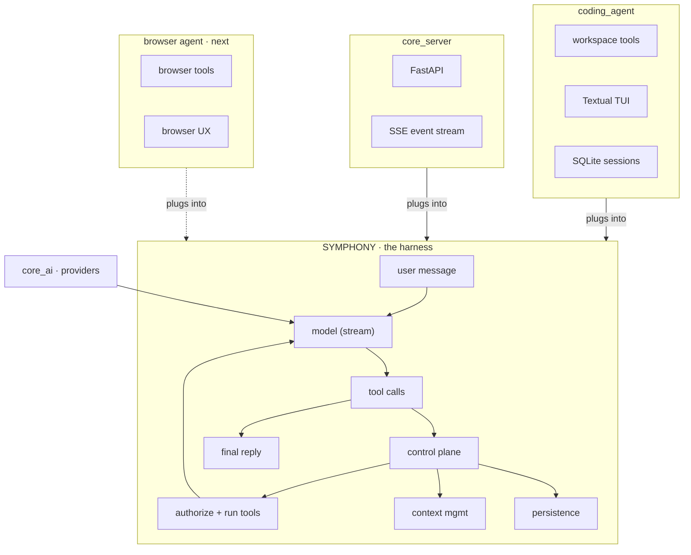

# Symphony

An open-source agent harness. Keep the loop product-agnostic, keep providers
swappable, and drive every UI from a single control-plane event stream.

<p>
  <a href="./docs/getting-started/installation.md"><strong>Install</strong></a>
  ·
  <a href="./docs/getting-started/quickstart.md"><strong>Quickstart</strong></a>
  ·
  <a href="./docs/README.md"><strong>Docs</strong></a>
  ·
  <a href="https://github.com/Sarthakischauhan/symphony">GitHub</a>
</p>

```sh
git clone https://github.com/Sarthakischauhan/symphony.git
cd symphony
uv sync
uv run --package symphony-code symphony   # asks for a provider + API key if none is set
# or: export OPENAI_API_KEY=sk-... then launch
```


The published packages are `symphony-core`, `symphony-harness`, and
`symphony-code`. `core-server` ships in this workspace. Python import names stay
`core_ai`, `core_harness`, `coding_agent`, and `core_server`.

---

## What it is

Symphony is the harness. Agents are separate consumers that plug into it.

It is not a copilot bolted to an IDE, and it is not a wrapper around a single
API. A turn is model stream → tool calls → authorize and run → back to the
model, with every UI reading the same typed events. Parent runs can spawn
children; those children reuse the stream, tagged with `parent_id` and
`agent_id`.

`symphony-code` is the first product on the harness (workspace tools, SQLite
sessions, Textual TUI). A browser-use agent is next.

<video src="./docs/demo.mp4" controls muted loop playsinline poster="./docs/demo.png" width="800">
  <a href="./docs/demo.mp4">Demo: symphony-code writes hello.py, a test, and runs pytest</a>
</video>



| Layer | Package | Role |
| --- | --- | --- |
| Harness | [`symphony-harness`](./core_harness/README.md) | Turns, tools, control-plane events, compaction |
| Harness | [`symphony-core`](./core_ai/README.md) | OpenAI, Anthropic, Gemini; catalog; streaming types |
| Agent | [`symphony-code`](./coding_agent/README.md) | Workspace tools, SQLite sessions, Textual TUI |
| Server | [`core-server`](./core_server/README.md) | FastAPI wrapper that streams those events over SSE |

---

## Install

**Requirements:** Python ≥ 3.11 and [uv](https://docs.astral.sh/uv/). At least
one provider key. If none is set, the TUI asks which provider to use.


### From source (TUI + all packages)

```sh
git clone https://github.com/Sarthakischauhan/symphony.git
cd symphony
uv sync
uv run --package symphony-code symphony
```

If no key is set, the TUI asks which provider to use. You can still export one
yourself (`OPENAI_API_KEY`, `ANTHROPIC_API_KEY`, or `GEMINI_API_KEY`).

`symphony`, `symphony-code`, and `coding-agent-tui` are the same entry point.

### As libraries

GitHub Releases publish wheels to PyPI.

```sh
uv add symphony-core
uv add symphony-harness
uv add symphony-code
```

```sh
pip install symphony-core symphony-harness symphony-code
```

| Package | Import | Install for |
| --- | --- | --- |
| [`symphony-core`](./core_ai/README.md) | `core_ai` | Providers, catalog, `Message` / `StreamEvent` |
| [`symphony-harness`](./core_harness/README.md) | `core_harness` | Agent loop, tools, control plane, compaction |
| [`symphony-code`](./coding_agent/README.md) | `coding_agent` | Workspace tools + Textual TUI |
| [`core-server`](./core_server/README.md) | `core_server` | FastAPI SSE of harness events (workspace) |

Full steps: **[Installation](./docs/getting-started/installation.md)**.

---

## Quick start

Launch against a project, pick a model, or resume:

```sh
uv run --package symphony-code symphony --workspace /path/to/project
uv run --package symphony-code symphony --model anthropic:claude-sonnet-5
uv run --package symphony-code symphony --resume
```

Then, in the TUI:

- Type `/` for slash commands. `/model` lists the generated catalog for
  providers that have credentials.
- `Tab` toggles **build** vs **plan**. Plan mode writes `.symphony/plans/`.
- `@` after whitespace inserts a workspace path.
- `Esc` cancels the in-flight run.

First conversation walkthrough: **[Quickstart](./docs/getting-started/quickstart.md)**.

The same loop as a library:

```python
from core_ai import build_default_registry, default_model_id
from coding_agent import CodingAgent

registry = build_default_registry()
agent = CodingAgent(
    registry=registry,
    model_id=default_model_id(registry),
    workspace=".",
)
result = await agent.run("Create hello.txt with hi, then read it back.")
print(result.output_text)
```

Harness-only, no coding-agent assumptions:

```python
from core_ai import build_default_registry, default_model_id
from core_harness import CoreHarness, Tool

def read_file(path: str) -> str:
    with open(path, "r", encoding="utf-8") as f:
        return f.read()

registry = build_default_registry()
harness = CoreHarness(
    registry=registry,
    model_id=default_model_id(registry),
    system_prompt="You are a concise coding assistant.",
    tools=[Tool(read_file)],
)
result = await harness.run("Inspect README.md and summarize it.")
print(result.output_text)
```

---

## Features

| | |
| --- | --- |
| **Streaming providers** | OpenAI Responses / Chat Completions, Anthropic Messages, and Gemini generateContent share `Message` / `StreamEvent`. Credentials register automatically. Models are `provider:model`. |
| **Generated catalog** | Package-shipped list of tool-calling text models, refreshed at build from [models.dev](https://models.dev), with a checked-in snapshot as fallback. |
| **Turn-based harness** | Multi-turn tool calls, schema generation, run caps (turns, tools, runtime, tokens). |
| **Control plane** | Typed events (thinking, `text_delta`, tools, usage, context, subagents). Authorization, user questions, always-allow, pause/cancel. Every event has `run_id`, `session_id`, seq, timestamp, schema version. |
| **Coding agent** | `read_file`, `write_file`, `generate_image`, `patch`, `search`, `bash`, `spawn_agent`. `@file` search, streamed bash, approval prompts, Textual TUI, 900-token-capped learning with a two-line **summary so far**. |
| **Context** | Warn thresholds, token estimates, pluggable compaction that keeps the system prompt, original task, and recent turns. |
| **Persistence** | `Persistence` protocol with checkpoints; SQLite sessions for TUI resume. |
| **SSE server** | FastAPI wrapper that forwards harness events unchanged. |

---

## Documentation

All package docs live under **[`docs/`](./docs/README.md)**:

| Section | What's covered |
| --- | --- |
| [Installation](./docs/getting-started/installation.md) | Source install, library install, provider keys |
| [Quickstart](./docs/getting-started/quickstart.md) | First TUI conversation, then a library run |
| [symphony-core](./docs/packages/symphony-core.md) | Providers, catalog, streaming types |
| [symphony-harness](./docs/packages/symphony-harness.md) | Loop, tools, events, limits, subagents |
| [symphony-code](./docs/packages/symphony-code.md) | Workspace agent and TUI |
| [core-server](./docs/packages/core-server.md) | FastAPI + SSE |
| [TUI](./docs/user-guide/tui.md) | Composer, modes, keybindings, images |
| [Configuration](./docs/user-guide/configuration.md) | `.symphony/config.json`, approvals, context |
| [Tools](./docs/user-guide/tools.md) | Workspace tool surface |
| [Learning](./docs/user-guide/learning.md) | Post-run reflection |
| [Sessions](./docs/user-guide/sessions.md) | SQLite resume |
| [Architecture](./docs/developer-guide/architecture.md) | How the four packages fit |
| [Events](./docs/developer-guide/events.md) | Control-plane catalog |
| [CLI](./docs/reference/cli.md) | Flags for `symphony` and `core-server` |
| [Environment](./docs/reference/environment.md) | Keys, models, base URLs |
| [Slash commands](./docs/reference/slash-commands.md) | Every TUI command |

---

## Development

Requires Python ≥ 3.11 and [`uv`](https://docs.astral.sh/uv/).

```sh
uv sync
uv run pytest
uv run --package symphony-code symphony
```

Each package has its own `README.md`, `pyproject.toml`, and tests. The stack is
**0.1.0** and under active development — APIs will keep evolving. See
[`plan.md`](./plan.md) for the roadmap.
