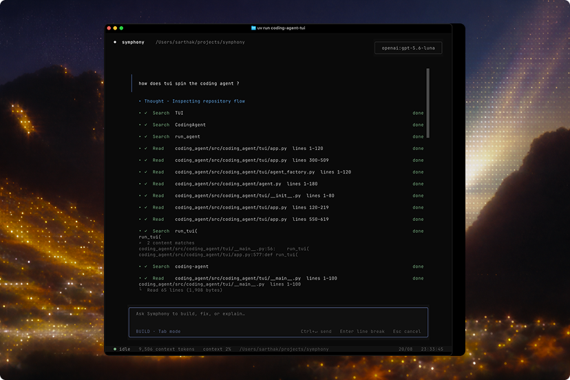
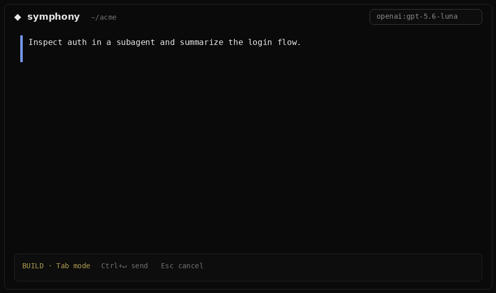

# symphony-code

A workspace coding agent built on `symphony-harness`. The Python module remains
`coding_agent` for API compatibility.

```sh
uv add symphony-code
```

```sh
export OPENAI_API_KEY=sk-...       # or ANTHROPIC_API_KEY / GEMINI_API_KEY
uv run --package symphony-code symphony
```

`symphony`, `symphony-code`, and `coding-agent-tui` are aliases for the same
TUI.

Docs: **[symphony-code](../docs/packages/symphony-code.md)** ·
[TUI](../docs/user-guide/tui.md) ·
[Tools](../docs/user-guide/tools.md) ·
[Slash commands](../docs/reference/slash-commands.md)

<div align="center">
  
</div>

<div align="center">
  
</div>

## What it provides

- Workspace tools: `read_file`, `write_file`, `generate_image`, `patch`,
  `search`, `bash`, `spawn_agent`, and `ask_user`
- Incremental repository discovery through `search` + `read_file`, without a
  preloaded repo index
- Persisted conversations in SQLite, resumable by `session_id` or TUI
  `--resume`
- Optional learning/reflection after successful runs
- A conversation-first Textual TUI with streaming output, tool events,
  reasoning summaries, usage stats, and context/compaction notices

## Tool surface

The agent intentionally exposes a small workspace tool surface:

- `read_file` reads bounded UTF-8 text with line numbers, or image files
  (png/jpeg/gif/webp) as visual content the model can see.
- `write_file` creates or replaces a complete file without stripping
  whitespace.
- `generate_image` generates a png/jpeg/webp from a prompt via the current
  OpenAI or Gemini provider, writes it to the requested path, and shows a
  clickable `[Image 1]` preview.
- `patch` performs unique-match exact-text edits. CRLF, trailing whitespace,
  and curly quotes are folded for matching; a miss lists nearby lines
  (whitespace made visible); identical old/new is a no-op, not an error.
- `search` finds file names or literal/regex content with path and glob
  filters.
- `bash` runs workspace-scoped shell commands with streamed, capped output, a
  timeout, and process-group cleanup. Non-zero exits and timeouts return the
  captured output; they are not tool failures.
- `spawn_agent` starts a child harness run for a focused subtask. Call it more
  than once in the same turn to run up to three children in parallel. Optional
  `model_id` and `max_turns` apply to that child only. Children run without
  approval prompts; the parent approval mode is unchanged. Click the Subagent
  row to open a nested session that uses the same transcript chrome as the
  parent.
- `ask_user` asks clarifying questions through the control plane.

Repository context is discovered incrementally with `search` and `read_file`;
the agent does not parse or preload a semantic repository index.

## Run it

Set at least one provider credential in the environment or `.env`:

| Provider | Credential | Optional model / base URL |
| --- | --- | --- |
| OpenAI | `OPENAI_API_KEY` | `OPENAI_MODEL`, `OPENAI_BASE_URL` |
| Anthropic | `ANTHROPIC_API_KEY` | `ANTHROPIC_MODEL`, `ANTHROPIC_BASE_URL` |
| Gemini | `GEMINI_API_KEY` or `GOOGLE_API_KEY` | `GEMINI_MODEL`, `GEMINI_BASE_URL` |

```bash
uv run --package symphony-code symphony
uv run --package symphony-code symphony --workspace /path/to/project
uv run --package symphony-code symphony --model gemini:gemini-3.7-flash
```

The TUI renders harness events as a conversation: streamed Markdown responses,
live tool rows, reasoning summaries, muted per-turn token usage, context
warnings, compaction notices, persisted session history, and code blocks using
the same muted Symphony palette as the surrounding interface. Use `Esc` (or
`Ctrl+X`) to cancel an in-flight run, `Ctrl+L` or `/clear` to reset the
visible transcript, and `Ctrl+D`, `/quit`, or `/exit` to leave. Learning is
enabled by default and each reflection is capped at 900 output tokens; pass
`--no-learning` to disable it.

Type `/` to discover commands. `/model` shows the generated `core_ai` catalog
for providers whose credentials are currently registered, `/model <id>`
switches the harness and learning model, and `/mode` switches between build
and read-only plan modes. Tab toggles the mode without opening the menu. Plan
mode uses a yellow composer border and writes streamed plans to readable,
task-named files such as `.symphony/plans/to_build_a_server_plan.md`. When
planning finishes, the plan opens in a modal with a **Build now** action;
`/plan` opens a searchable picker for all saved workspace plans. `/new` starts
a new persisted session, `/compact` keeps the system prompt, the original
task, and the most recent turns (with a summary of dropped work), `/context`
opens a modal that breaks down stored vs sent tokens by role, `/reload`
reloads `.env` and rebuilds the provider registry, `/diff` opens the current
workspace diff in a modal, `/status` displays the current runtime context,
`/help` shows commands, and `/clear` clears the visible transcript.

Type `@` anywhere after whitespace to search workspace files in the same
selector; Tab or Enter inserts the selected `@path` without sending the
prompt. Drop an image onto the composer (terminals paste the file path) to
attach it as a clickable `[Image 1]` chip; click the chip to open a large
preview modal. `generate_image` writes the asset to disk and uses the same
`[Image 1]` chip on the tool row so you can preview it the same way.

The TUI registers every provider for which a credential is available. Pass
`--model`, or set `SYMPHONY_MODEL`, to pick a `provider:model` id such as
`anthropic:claude-sonnet-5` or `gemini:gemini-3.7-flash`. Without that
override, provider-specific `*_MODEL` variables are checked before the default
for the first available provider (OpenAI, Anthropic, then Gemini). `/reload`
rebuilds both the provider registry and these model choices, so the TUI has no
separate hardcoded model inventory.

```python
from core_ai import build_default_registry, default_model_id
from coding_agent import CodingAgent

registry = build_default_registry()
agent = CodingAgent(
    registry=registry,
    model_id=default_model_id(registry),
    workspace=".",
)
result = await agent.run("Fix the failing test")
```

The agent asks before running `bash`, overwriting an existing file, or
applying a broad patch. Answer **Allow once** or **Deny**. Plan-mode reads
stay unprompted. Runs default to 24 turns, 40 tool calls, and 10 minutes, with
no aggregate token failure limit. Provider 429 responses remain in a live
Working state and retry after the server-requested delay.

## Configuration

Starting a coding agent writes a complete settings file to
`<workspace>/.symphony/config.json`. That file is the source of truth for the
spawn: harness limits, tool-result pruning, compaction, context thresholds,
approvals, tool I/O bounds, and learning. There is no packaged defaults JSON.
If the file is missing, spawn generates it from `CodingAgentConfig` field
defaults. See [`config.example.json`](./config.example.json) for the
user-facing shape.

Pass the settings path or a loaded `CodingAgentConfig` into `CodingAgent` /
`CoreHarness`. Constructors do not take a long list of config kwargs.

Approval is owned by the control plane, not by wrapped tools. Set
`approvals.mode` to `"ask"` for interactive gates or `"always_allow"` to let
the control plane authorize every tool call without showing a prompt. Choosing
**Always allow** in the TUI is a run-level override: it applies only to the
current run (including its child agents) and does not change the persistent
`.symphony/config.json` used by future runs.

Full reference: [Configuration](../docs/user-guide/configuration.md).

## Learning

Learning is enabled by default. After a successful run returns, a background
reflection makes one structured model call capped at 900 output tokens. Useful
lessons are appended to:

```text
<workspace>/.symphony/learning/lessons.jsonl
```

Reflection never delays or changes the completed run. Future runs receive only
a small task-relevant selection of lessons. Routine runs can return
`should_save=false`, and reflection failures are logged without affecting the
agent.

Disable learning with `"learning": {"enabled": false}` in the spawn settings
file or `enable_learning=False` / `symphony --no-learning`. Call
`await agent.shutdown_learning()` (or `wait_for_learning()`) when an
application needs to cancel or drain pending reflection tasks before shutdown.
The TUI does this automatically on exit.

Conversation persistence is managed under
`<workspace>/.symphony/sessions.sqlite3`, allowing resuming of sessions using
`session_id` or the TUI `--resume` command.

Automatic context compaction is enabled by default. When a model has 16,000 or
fewer context tokens left, the harness keeps the system prompt, the original
task, and the ten most recent messages before the next model call. Dropped
messages are summarized (with paths already observed) rather than discarded
silently. A one-user tool loop is not treated as a single un-droppable turn.
Tool results are capped at 4,000 characters when they enter history; the
truncated body is what is stored. Older tool bodies are stubbed only after the
estimated prompt reaches `tool_result_prune_tokens` (48,000 by default), and
stubs name the path so the model does not re-read them. The warning threshold,
compaction threshold, recent-message count, post-compact target, insert-time
cap, and prune budget can be customized with `context_warn_threshold`,
`context_compact_threshold`, `compaction_keep_recent`,
`context_target_tokens`, `tool_result_max_chars`, `tool_result_keep_recent`,
and `tool_result_prune_tokens`; pass `context_compact_threshold=None` to
disable auto-compact.
