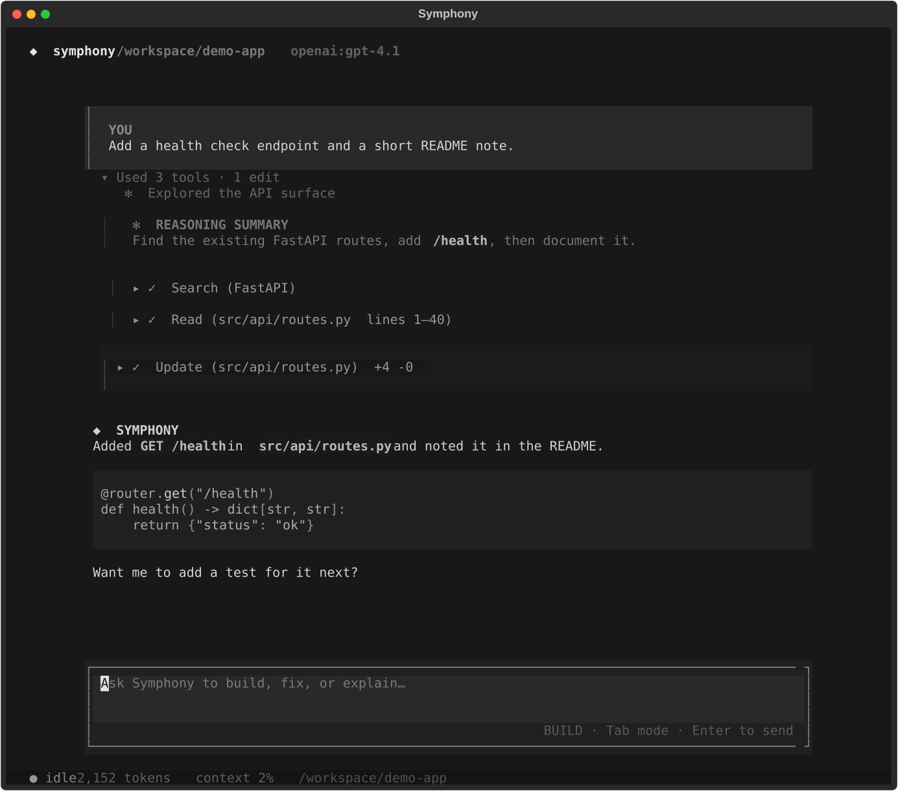

# coding_agent

Workspace coding agent for [Symphony](../README.md) — five tools, persisted sessions, and a conversation-first Textual TUI built on `core_harness`.

<p align="center">
  
</p>

<p align="center">
  <em>Search → read → patch, streamed as a conversation with reasoning, tool rows, and usage.</em>
</p>

## What it provides

- Five workspace tools: `read_file`, `write_file`, `patch`, `search`, and `bash`
- Incremental repository discovery through `search` + `read_file`, without a preloaded repo index
- Persisted conversations in SQLite, resumable by `session_id` or TUI `--resume`
- Optional learning/reflection after successful runs
- A conversation-first Textual TUI with streaming output, tool events, reasoning summaries, usage stats, and context/compaction notices

## Requirements

- Python ≥ 3.11
- [`uv`](https://docs.astral.sh/uv/)
- An OpenAI-compatible API key (`OPENAI_API_KEY`)

From the monorepo root:

```bash
uv sync
export OPENAI_API_KEY=...
```

## Quick start

```bash
uv run --package coding-agent coding-agent-tui
uv run --package coding-agent coding-agent-tui --workspace /path/to/project
```

Resume a previous session interactively:

```bash
uv run --package coding-agent coding-agent-tui --resume
```

Optional flags:

| Flag | Description |
| --- | --- |
| `--workspace PATH` | Workspace for file/shell tools (default: current directory) |
| `--model ID` | Model id (default: `OPENAI_MODEL` or `openai:gpt-4o-mini`) |
| `--resume` | List saved sessions and pick one to continue |

## Tool surface

The agent intentionally exposes five workspace tools:

| Tool | Role |
| --- | --- |
| `read_file` | Reads bounded UTF-8 content |
| `write_file` | Creates or replaces a complete file without stripping whitespace |
| `patch` | Performs unique-match exact-text edits |
| `search` | Finds file names or literal/regex content with path and glob filters |
| `bash` | Runs workspace-scoped shell commands |

Repository context is discovered incrementally with `search` and `read_file`; the
agent does not parse or preload a semantic repository index.

## TUI

The TUI renders harness events as a conversation: streamed Markdown responses,
live tool rows, reasoning summaries, muted per-turn token usage, context warnings,
compaction notices, persisted session history, and code blocks using the same
muted Symphony palette as the surrounding interface.

| Keys / commands | Action |
| --- | --- |
| `Enter` | Send the composer message |
| `Tab` | Toggle build ↔ plan mode |
| `Ctrl+L` / `/clear` | Reset the visible transcript |
| `Ctrl+D` / `/quit` / `/exit` | Leave the TUI |
| `/` | Discover slash commands |

Type `/` to discover commands. `/model` shows the built-in model catalog,
`/model <id>` switches the harness and learning model, and `/mode` switches between
build and read-only plan modes. Tab toggles the mode without opening the menu.
Plan mode uses a yellow composer border and writes streamed plans to readable,
task-named files such as `.symphony/plans/to_build_a_server_plan.md`. When planning
finishes, the plan opens in a modal with a **Build now** action; `/plan` opens a
searchable picker for all saved workspace plans.
`/new` starts a new persisted session, `/compact` keeps the system prompt and recent
valid tool-call blocks, `/diff` opens the current workspace diff in a modal,
`/status` displays the current runtime context, `/help` shows commands, and `/clear`
clears the visible transcript.
Model choices currently come from `coding_agent.tui.commands.MODEL_CATALOG`; this
boundary can be replaced with provider-backed registry discovery later.

Regenerate the README screenshot (no API key required):

```bash
uv run --package coding-agent python coding_agent/scripts/capture_readme_screenshot.py
```

## Library usage

```python
from coding_agent import CodingAgent

agent = CodingAgent(
    registry=registry,
    model_id="openai:gpt-4o-mini",
    workspace=".",
)
result = await agent.run("Fix the failing test")
```

## Learning

After a successful run returns, an optional background reflection makes one
structured model call. Useful lessons are appended to:

```text
<workspace>/.symphony/learning/lessons.jsonl
```

Reflection never delays or changes the completed run. Future runs receive only a
small task-relevant selection of lessons. Routine runs can return
`should_save=false`, and reflection failures are logged without affecting the agent.

Disable learning with `enable_learning=False`. Call
`await agent.wait_for_learning()` only when an application needs to drain pending
reflection tasks before shutdown.

## Persistence

Conversation persistence is managed under
`<workspace>/.symphony/sessions.sqlite3`, allowing resuming of sessions using
`session_id` or the TUI `--resume` command.

## Development

```bash
uv sync
uv run --package coding-agent pytest
uv run --package coding-agent coding-agent-tui
```

See the [repository README](../README.md) for the broader Symphony harness layout
(`core_ai`, `core_harness`, and this package).
