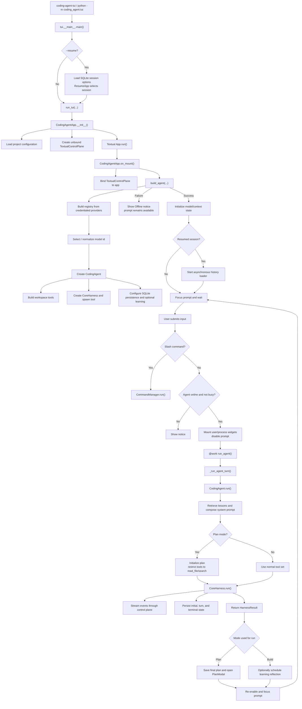
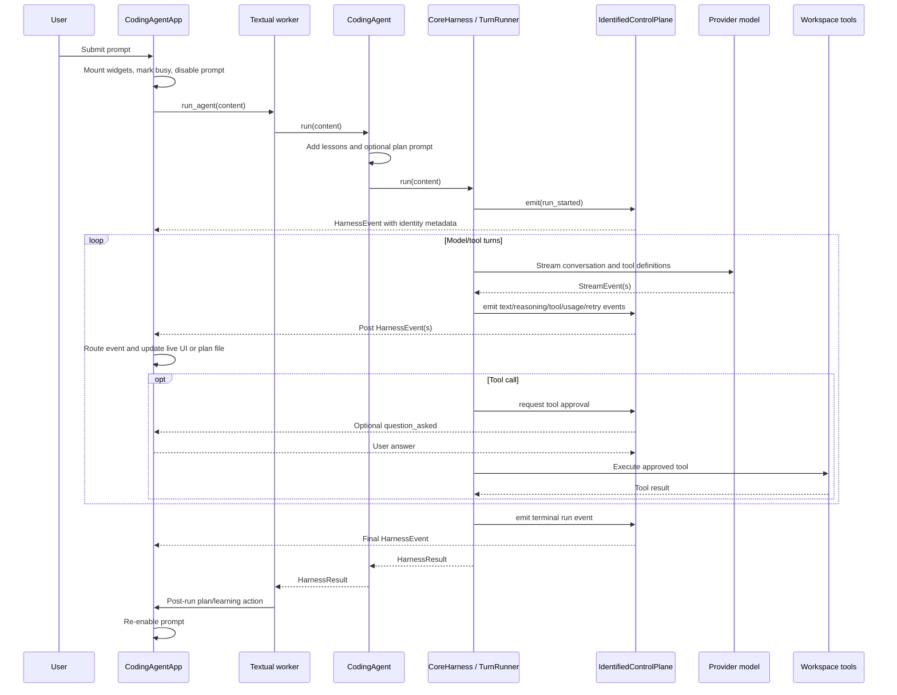
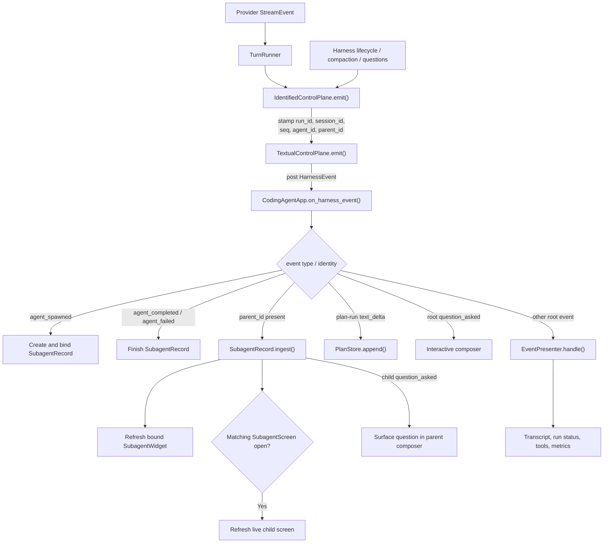
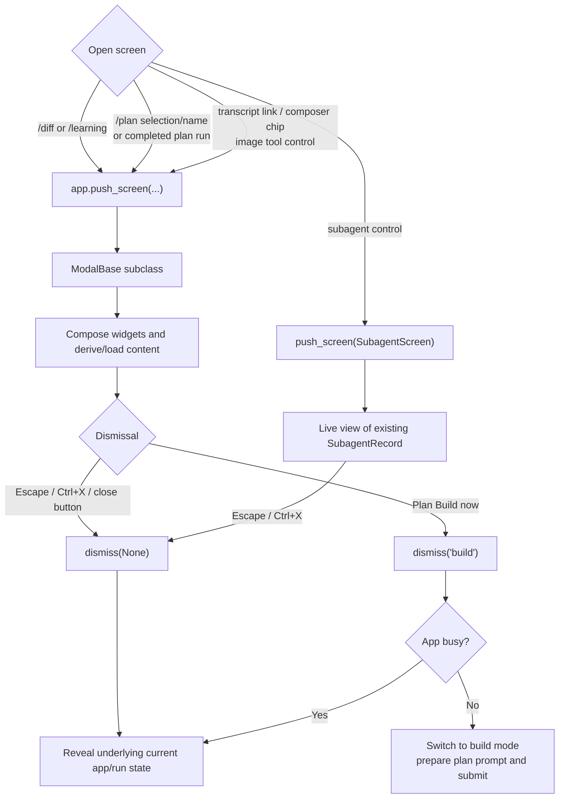

# TUI Coding Agent Architecture

This document describes the current implementation. It was validated against the code in
`coding_agent/src/coding_agent/tui`, `coding_agent/src/coding_agent/agent.py`, and
`core_harness/src/core_harness`.

## Startup and execution flow



`TextualControlPlane` is created in `CodingAgentApp.__init__()` and bound to the app in
`on_mount()`. If agent construction fails, the TUI remains usable in an offline state.
For a resumed session, transcript history is loaded by a non-exclusive Textual worker
after the agent has been built.

Workspace tools are not wrapped with approval decorators. `TurnRunner` asks the active
control plane to approve a tool call immediately before execution. The TUI control plane
implements the product's approval policy and may ask the user through the composer.

## Prompt execution and event sequence



Normal assistant output is rendered from streaming `text_delta` events, not from the
returned `HarnessResult`. The result is used for post-run behavior such as saving a plan
or scheduling learning. Persistence occurs after the new user message, after relevant
turns, and on terminal paths rather than only once at the end.

In plan mode, plan storage has two layers: the TUI initializes the selected plan before
the worker starts and appends root `text_delta` events as they arrive; `CodingAgent.run()`
also initializes the plan and saves the final result after a successful run. Plan deltas
are intentionally intercepted before the normal root presenter, so they are written to
the plan rather than rendered as a normal assistant response.

## Event architecture

Provider events reach the UI through the harness control-plane boundary:



### Event producers and consumers

- `CoreHarness` emits run lifecycle events such as `run_started`, `run_completed`,
  `run_failed`, `run_cancelled`, and `run_limit_exceeded`.
- `TurnRunner` translates provider streams into turn, text, reasoning, retry, usage,
  context, and tool events. It also emits tool execution events.
- `IdentifiedControlPlane` stamps events and delegates to its inner control plane.
- `TextualControlPlane` posts `HarnessEvent` messages to Textual. It also owns TUI
  cancellation, question futures, and tool-approval policy.
- `CodingAgentApp.on_harness_event()` applies the routing order shown above.
- `EventPresenter.handle()` maps remaining root events to `_on_<event_type>` handlers.
  Unknown events become transcript notices instead of being silently ignored.
- `SubagentRecord` stores child state independently of whether its full-screen view is
  open. The app refreshes embedded child widgets and refreshes `SubagentScreen` only when
  the matching screen is active.

Parent-side `agent_spawned`, `agent_completed`, and `agent_failed` events are lifecycle
notifications keyed by `child_id`. Events from the child's own run use the child
`agent_id` and carry the parent agent's ID in `parent_id`.

### Retry reset behavior

A retry event can set `resets_stream`. `TurnRunner` then discards the failed attempt's
partial assistant text, reasoning, pending calls, and attempt-specific usage. The TUI
clears partial assistant and reasoning output. It does not currently remove tool rows or
arguments already displayed for the failed attempt, and displayed usage may remain until
later events update it.

### Current limitations and extension points

- `ControlPlaneEventType` does not enumerate every emitted event. Current omissions
  include `reasoning_delta`, `model_retry_scheduled`, and `question_asked`. Arbitrary
  strings remain accepted by the event models and emitters.
- Event payloads are unrestricted dictionaries; there are no per-event payload models at
  the TUI boundary.
- Sequence numbers are local to each `IdentifiedControlPlane` instance. Normal run events
  share an identity, but parent child-lifecycle emissions may be stamped through separate
  temporary identified planes.
- Root `EventPresenter` renders every tool completion as `done`, regardless of an emitted
  error, timeout, or cancellation status. `SubagentRecord` maps only `error` to failure;
  timeout and cancellation currently become done.
- Generic harness pause/resume support is boundary-based, but `TextualControlPlane`
  currently accepts cancellation only. The TUI cannot issue pause/resume commands.
- Provider streaming cancellation is observed promptly through the shared cancel event;
  tool cancellation still depends on the active tool returning or observing cancellation.
- An unbound `TextualControlPlane` drops emitted events rather than buffering them.
- `FanoutControlPlane` and `InteractiveControlPlane` await subscribers sequentially, so a
  subscriber failure can block later subscribers. These adapters are a generic harness
  concern and are not part of the direct TUI path shown above.

## Modal architecture

The TUI uses Textual's screen stack. `ModalBase` extends `ModalScreen` and supplies a
shared priority Escape-to-dismiss binding. Centered dialogs separately compose a
`ModalCloseButton`; `ModalScroll` duplicates Escape handling so a focused scroll body
cannot consume the key.



### Modal implementations

- `tui/modal.py` contains `ModalBase`, `ModalScroll`, `ModalCloseButton`, `ContentModal`,
  `DiffModal`, `LearningModal`, and `PlanModal`.
- `tui/images.py` contains `ImageModal`, which is exposed lazily from `tui.modal` to avoid
  an eager import cycle.
- `tui/subagent.py` contains `SubagentScreen`, a full-screen live view of an existing
  child-agent record. It does not create or own an independent session.
- `tui/styles.py` contains common and specialized modal CSS.

`/diff` and `/learning` directly push their modals. `/plan` without an argument opens a
plan picker in the slash menu; selecting a plan, providing a plan name, or completing a
plan-mode run opens `PlanModal`. Content and image screens can be opened from transcript
links, composer paste/image chips, and image-related tool controls. Subagent controls can
open `SubagentScreen`.

`PlanModal` is the main result-bearing screen. `Build now` dismisses with `"build"`. If
the app is not busy, its callback switches both app and agent to build mode, inserts a
`Build the approved plan...` prompt, and submits it immediately. If the app is busy, the
callback ignores the build result. Informational modals dismiss with `None` and simply
reveal the underlying app, which may still have an active run.

Both Escape and Ctrl+X are bound to the app's cancel action, which dismisses an active
`ModalScreen` before attempting to cancel a run. Escape also has modal-local priority
bindings in `ModalBase` and `ModalScroll`. Close and build controls are focusable and
keyboard-operable, but there is no shared initial-focus or focus-restoration policy.

Diff, learning, and plan data are loaded synchronously during `compose()`. `ContentModal`
uses text supplied to its constructor; `ImageModal` derives a preview from a supplied
attachment; `SubagentScreen` projects an existing record. There is currently no shared
loading state, compose-time error boundary, backdrop-click dismissal, or generic modal
lifecycle hook.

## Key execution path

```text
coding-agent-tui
  → coding_agent.tui.__main__.main()
  → optional ResumeApp
  → run_tui()
  → CodingAgentApp.__init__()
      → load config
      → create TextualControlPlane
  → Textual App.run()
  → CodingAgentApp.on_mount()
      → bind control plane
      → build_agent()
      → optional asynchronous history load
  → prompt submission
  → @work CodingAgentApp.run_agent()
  → CodingAgent.run()
  → CoreHarness.run()
  → TurnRunner model/tool loop
  → identified control-plane events
  → CodingAgentApp event routing
```

The coding agent runs asynchronously in-process on Textual's event loop; it is not
launched as a separate subprocess.
