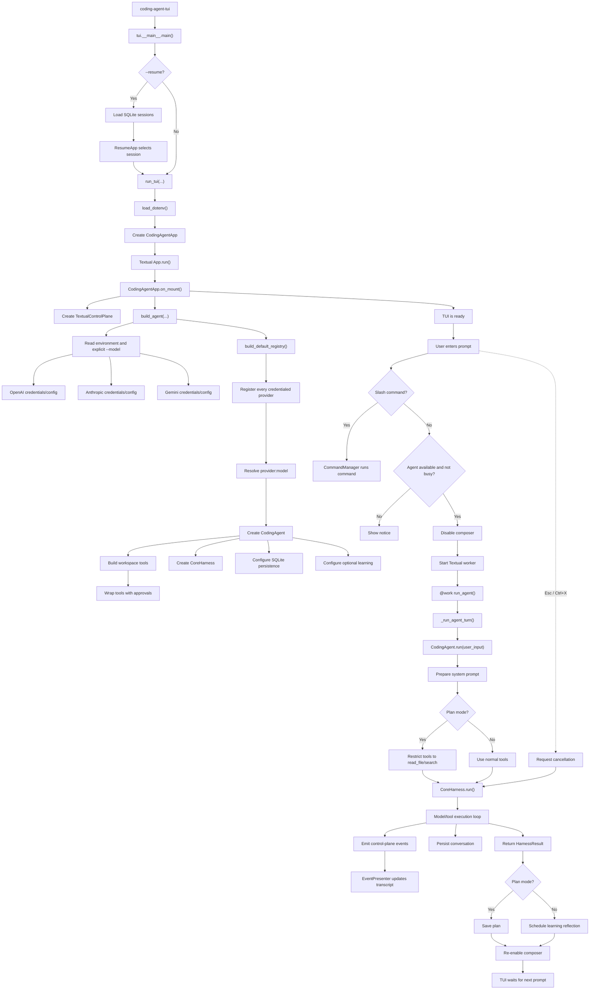
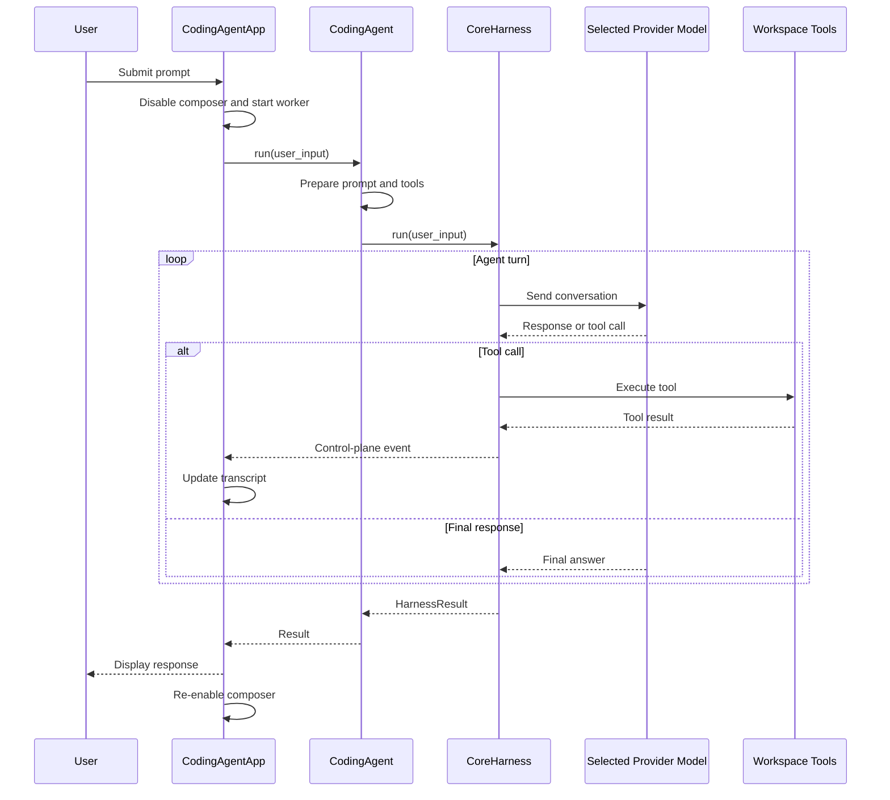

# TUI Coding Agent Architecture

## Startup and execution flow



## Prompt execution sequence



## Key execution path

```text
coding-agent-tui
  → main()
  → run_tui()
  → CodingAgentApp.run()
  → on_mount()
  → build_agent()
  → CodingAgent(CoreHarness)
  → user submits prompt
  → Textual worker run_agent()
  → CodingAgent.run()
  → CoreHarness.run()
  → model/tool loop
```

The TUI creates the `CodingAgent` in-process and runs it asynchronously inside Textual's event loop; it does not launch the agent as a separate subprocess.
