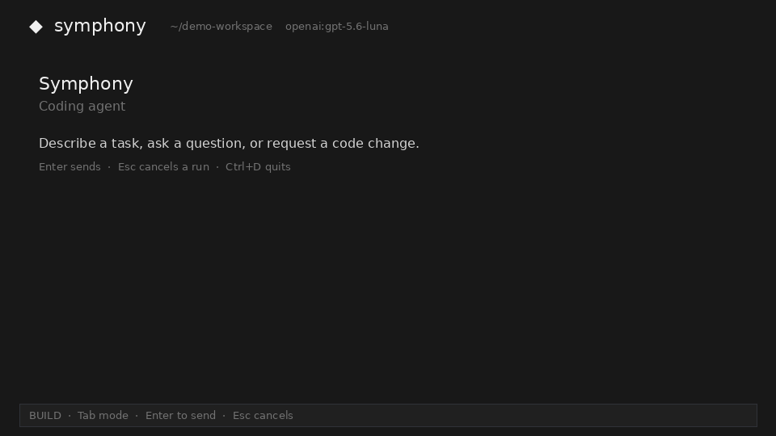

# Product demo

A single-take walkthrough of the `coding_agent` TUI: one agentic build task, the
approval gate, the diff viewer, read-only plan mode, the model catalog, and the
status panel.

<div align="center">
  
</div>

Full-resolution recording: [`docs/demo.mp4`](./demo.mp4) (68s, 1920×1142).

## What the walkthrough shows

| # | Capability | What happens on screen |
|---|---|---|
| 1 | **Workspace context** | The top bar shows the active workspace and the resolved `provider:model` id. |
| 2 | **Agentic tool use** | One prompt — *"Add a /health endpoint and a test for it."* — drives `search` → `read_file` → `patch` → `write_file`. Each tool is its own collapsible row with a live status. |
| 3 | **Streamed reasoning** | Reasoning summaries and assistant text stream token by token rather than appearing at the end of the turn. |
| 4 | **Approval gate** | Before `bash` runs, the agent pauses on **Allow once / Deny** and the status line switches to `paused`. Nothing executes until it is approved. |
| 5 | **Verification** | The approved `python -m pytest -q` runs in the workspace and its real output lands on the tool row. |
| 6 | **Grounded answer** | The final reply cites the files it touched and shows the code it added. |
| 7 | **Diff review** | `/diff` opens the actual `git diff` for the workspace, per file, with add/remove counts. |
| 8 | **Plan mode** | `Tab` switches to read-only plan mode. The agent may only `search` and `read_file`, writes the plan to `.symphony/plans/<task>_plan.md`, and opens it in a modal with a **Build now** action. |
| 9 | **Model catalog** | `/model ` lists the generated `core_ai` catalog, filtered to providers whose credentials are registered. |
| 10 | **Run context** | `/status` reports the active model, mode, session id, and token usage. |

## Reproducing it

The recording is driven by a scripted, OpenAI-compatible model server so the
walkthrough is deterministic and needs no provider credentials. Everything below
the provider boundary is real: the harness loop, approval prompts, workspace
tools, git, and SQLite persistence all run normally, and the sample project is
genuinely modified on disk.

```sh
uv run --package coding-agent python coding_agent/scripts/demo/run_demo.py
```

This seeds a small FastAPI project at `/tmp/symphony-demo/checkout-service`
(recreated on each launch, with a git baseline so `/diff` has something to
compare against), starts the scripted model server on `127.0.0.1:8099`, and
launches the TUI against it.

| Path | Role |
|---|---|
| `coding_agent/scripts/demo/run_demo.py` | Seeds the sample project, starts the model server, launches the TUI |
| `coding_agent/scripts/demo/mock_model_server.py` | Serves the Responses API shape and replays a fixed plan of tool calls |

Useful flags:

```sh
# Keep the workspace from a previous run instead of recreating it
uv run --package coding-agent python coding_agent/scripts/demo/run_demo.py --keep-workspace

# Move the scripted model server to another port
uv run --package coding-agent python coding_agent/scripts/demo/run_demo.py --port 9100
```

To drive the same walkthrough against a real provider, set a credential and
point the TUI at any project instead:

```sh
export OPENAI_API_KEY=...
uv run --package coding-agent coding-agent-tui --workspace /path/to/project
```

## Terminal requirements

The composer submits on `Ctrl+Enter`, which a terminal can only report if it
supports the [kitty keyboard protocol](https://sw.kovidgoyal.net/kitty/keyboard-protocol/)
(kitty, WezTerm, foot, Ghostty, and recent Alacritty). VTE-based terminals such
as GNOME Terminal and xfce4-terminal send the same bytes for `Enter` and
`Ctrl+Enter`, so the prompt cannot be submitted there. The recording was made in
kitty.
