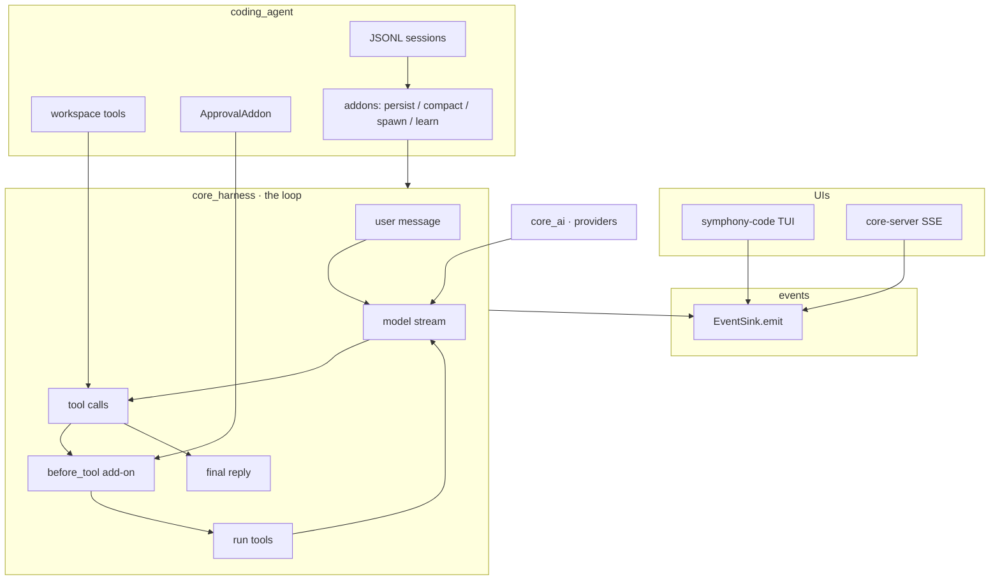
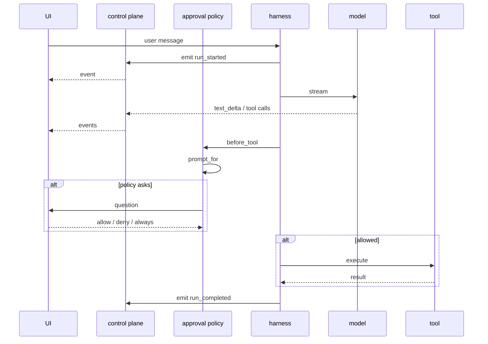

# Architecture

Symphony is the harness. Agents are separate consumers that plug into it.

Keep the harness product-agnostic, keep the provider layer swappable, and
drive every UI from a single control-plane event stream instead of scraping
output. Parent runs can spawn child agents; those children reuse the same
stream, tagged with `parent_id` and `agent_id`.

## Layers

| Layer | Package | Role |
| --- | --- | --- |
| Harness | `symphony-harness` | Turns, tools, control-plane events, compaction |
| Harness | `symphony-core` | OpenAI, Anthropic, Gemini, Grok; catalog; streaming types |
| Agent | `symphony-code` | Workspace tools, JSONL sessions, Textual TUI |
| Server | `core-server` | FastAPI wrapper that streams those events over SSE |



The harness is a library loop: tools, model, compaction, and an event sink
for UIs. It does not authorize tools or cancel runs. Product approval lives
in `coding_agent.approvals.ApprovalAddon` (`before_tool`). Cancel a run by
cancelling the `asyncio.Task` awaiting `CoreHarness.run`.

## A turn

A turn is `CodingAgent.run` → `CoreHarness.run` → `TurnRunner` →
`ModelRegistry.stream` → authorize → `WorkspaceTool.execute`. No façade
objects in between.



## Source layout

```text
core_ai/src/core_ai/
  content.py          # multimodal parts
  types.py            # Message, StreamEvent
  registry.py         # provider:model routing
  models/             # generated catalog snapshot (scripts/generate_models.py owns generated.py)
  providers/
    base.py           # BaseProvider contract
    openai.py         # chat + responses + images
    anthropic.py
    gemini.py
    grok.py
    http.py           # SSE + 429 / SSL MAC / hard-error retry
    catalog.py        # provider catalog helpers
    defaults.py       # credential-aware default registry

core_harness/src/core_harness/
  harness.py          # CoreHarness: tools, limits, run loop, attach add-ons, spawn
  tools.py            # Tool adapter
  events.py           # EventSink event sink (default records in memory)
  models.py           # ControlPlaneEventType, ToolCall, HarnessResult
  config.py           # HarnessConfig, load_harness_config
  errors.py           # HarnessCancelled, HarnessLimitExceeded
  context/            # token estimates, pruning, HarnessState, keep/drop planner
  loop/               # TurnRunner, tool calls, run session, stream handling
  addons/             # Addon base, persistence, compaction, subagent

coding_agent/src/coding_agent/
  agent.py            # CodingAgent + default_addons
  approvals.py        # product policy; TUI only renders the question
  config.py           # .symphony/config.json model
  credentials.py      # ~/.symphony/.env handling
  prompts.py          # system + plan-mode prompts
  plan.py             # plan mode (.symphony/plans/)
  tools/              # one file per workspace tool
  compaction/         # AiCompactionAddon + InferenceCompactor
  learning/           # after-run reflection, lesson store, run_summary
  persistence/        # JSONL sessions
  tui/                # Textual app, driven by CP events

core_server/src/core_server/
  app.py              # FastAPI app, /runs, /models, /health
  sse.py              # SSE control plane
  config.py           # ServerConfig / build_config
  request_limits.py   # body / message / history caps
```

Each package is a small set of modules, one concept per file. Leaf packages of
20-line files are avoided.

## Design principles

1. One tool per file. Same shape everywhere (`WorkspaceTool` + `run` + register).
2. Harness stays product-agnostic. Coding-agent specifics live in `coding_agent`.
3. Working directory, not a jail. Relative paths start at the launch
   directory; absolute and `~` paths are allowed. `bash` runs with the user's
   permissions behind an approval prompt; there is no container or OS-level
   isolation.
4. Events for UX. UIs subscribe to the sink and cancel the run task. They
   do not scrape stdout, and they do not own persistence or compaction.
5. Tests without keys first. Unit-test tools and harness; keep live tests opt-in.

## What's next

0.1.0 is the first public cut. Durable memory, a skill/plugin loader, and
compaction-as-a-view (full user log, compact model projection) are specified
under "Symphony-later" in [`plan.md`](../../plan.md). A browser-use agent is
the next consumer of the same harness.

## Development

```sh
uv sync
uv run pytest
uv run --package symphony-code symphony
```
