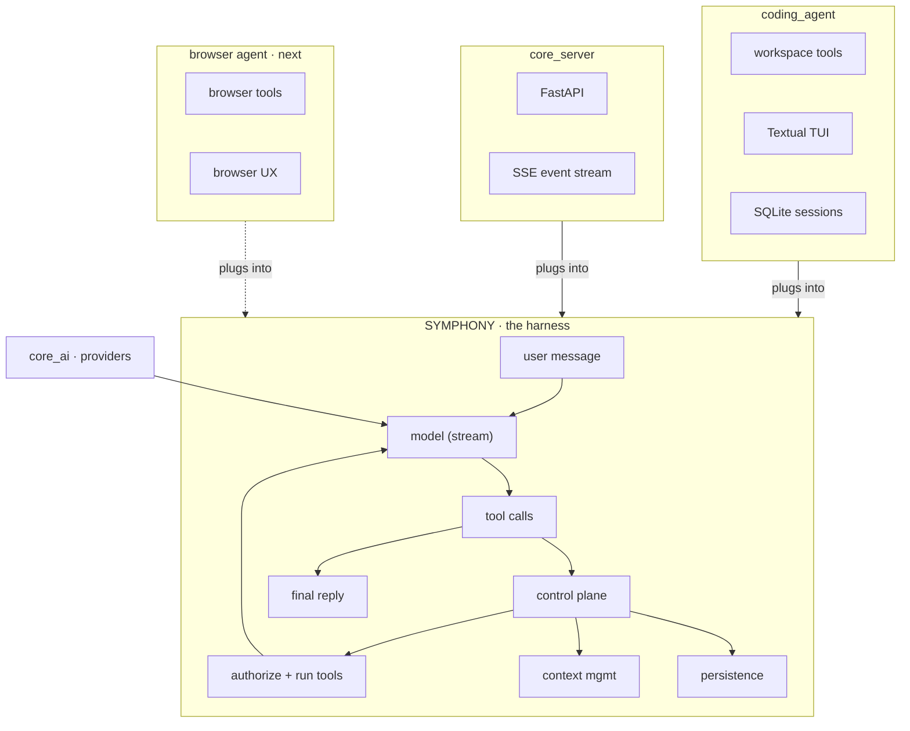

# Architecture

Symphony is the harness. Agents are separate consumers that plug into it.

Keep the harness product-agnostic, keep the provider layer swappable, and
drive every UI from a single control-plane event stream instead of scraping
output. Parent runs can spawn child agents; those children reuse the same
stream, tagged with `parent_id` and `agent_id`.

## Layers

| Layer | Package | Role |
| --- | --- | --- |
| Harness | `symphony-harness` | Turns, tools, control-plane events, compaction |
| Harness | `symphony-core` | OpenAI, Anthropic, Gemini, Grok; catalog; streaming types |
| Agent | `symphony-code` | Workspace tools, SQLite sessions, Textual TUI |
| Server | `core-server` | FastAPI wrapper that streams those events over SSE |



## A turn

A turn is `CodingAgent.run` → `CoreHarness.run` → `TurnRunner` →
`ModelRegistry.stream` → `WorkspaceTool.execute`. No façade objects in
between.

## Source layout

```text
core_ai/src/core_ai/
  content.py          # multimodal parts
  types.py            # Message, StreamEvent
  registry.py         # provider:model routing
  models/             # generated catalog (script-owned)
  providers/
    openai.py         # chat + responses + images
    anthropic.py
    gemini.py
    http.py           # SSE + 429 / SSL MAC / hard-error retry
    defaults.py

core_harness/src/core_harness/
  harness.py          # CoreHarness: tools, limits, run loop, attach add-ons
  tools.py            # Tool adapter
  events.py           # control planes
  context/            # token estimates, pruning, harness state
  loop/               # turn runner, calls, session
  models.py           # events, tools, result
  addons/             # Addon base, persistence, compaction, telemetry, subagent

coding_agent/src/coding_agent/
  agent.py            # CodingAgent + build_agent
  tools/              # one file per workspace tool
  tui/                # Textual app, driven by CP events
  learning/           # after-run reflection + transcript recap
  persistence/        # SQLite sessions
```

Each package is a small set of modules, one concept per file. Leaf packages of
20-line files are avoided.

## Design principles

1. One tool per file. Same shape everywhere (`WorkspaceTool` + `run` + register).
2. Harness stays product-agnostic. Coding-agent specifics live in `coding_agent`.
3. Workspace sandbox. All FS tools resolve under a root; escapes raise.
4. Control plane for UX. UIs subscribe to CP events; they do not scrape stdout.
5. Tests without keys first. Unit-test tools and harness; keep live tests opt-in.

## What's next

A browser-use agent is the next consumer of the same harness. Pause/resume
bindings in the TUI, richer lesson synthesis, and multi-language AST are the
near-term product gaps. See [`plan.md`](../../plan.md).

## Development

```sh
uv sync
uv run pytest
uv run --package symphony-code symphony
```
