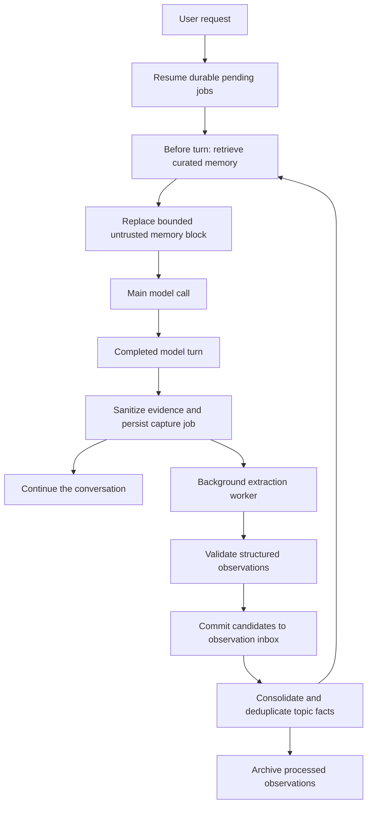
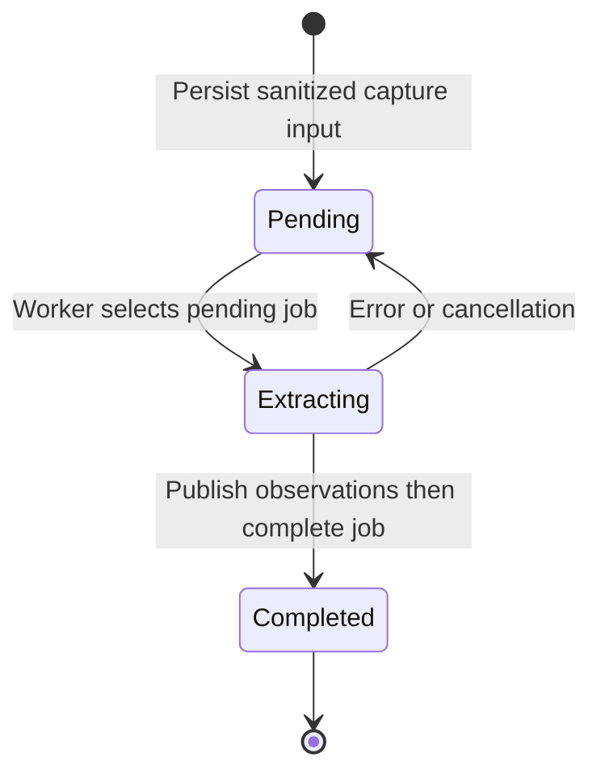
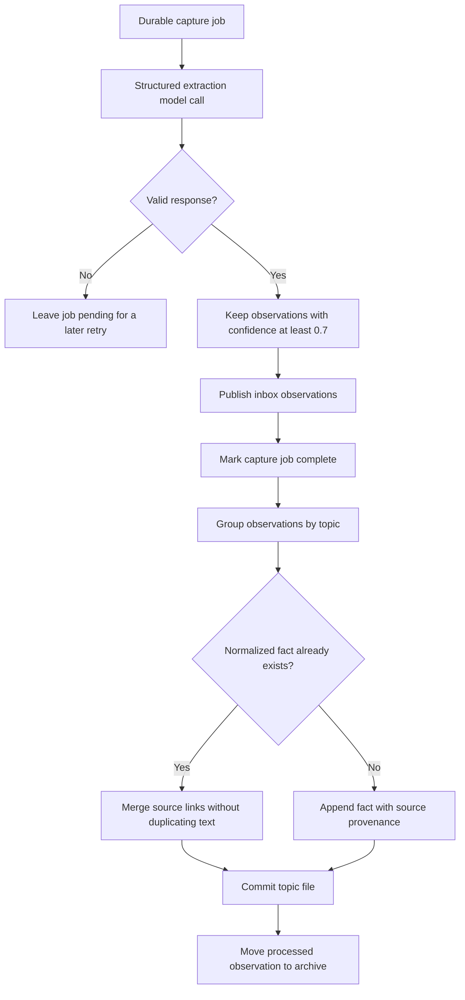
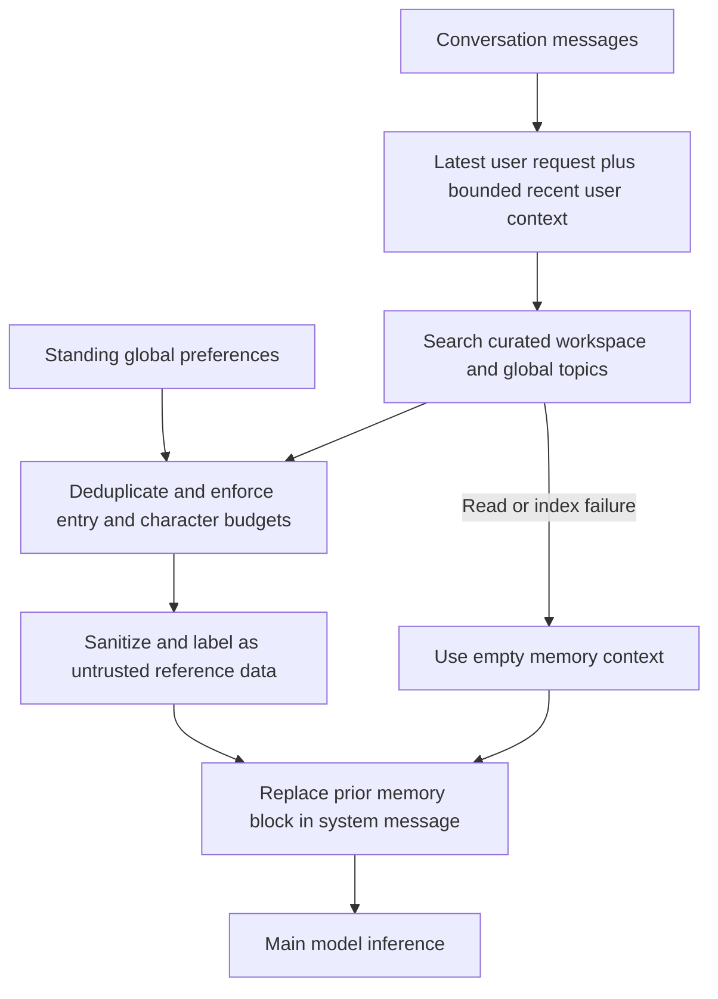
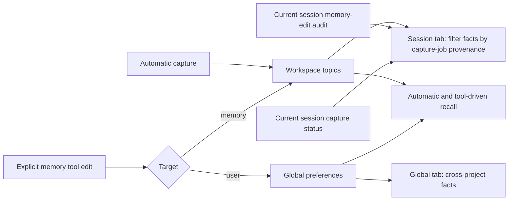

# How Symphony learning works

Symphony separates **capturing evidence**, **extracting observations**,
**consolidating knowledge**, and **retrieving context**. Learning is automatic:
there are no `/flush` or `/dream` commands.

This page describes the implemented memory-v2 pipeline. For settings and user
controls, see [Memory and learning](../user-guide/learning.md). For the complete
conversation archive, see [Sessions](../user-guide/sessions.md).

> **Diagram support:** the fenced `mermaid` blocks below render directly on
> GitHub. In a local Markdown editor, enable its Mermaid preview support. No
> external scripts, HTML embeds, or diagram service are required by this page.

## 1. The complete loop

The main conversation does not wait for the extraction model call. Persisting
capture evidence is synchronous and happens **before** starting background work.
Memory I/O errors at the capture/injection boundary are logged and do not
intentionally fail the main turn.

Retrieval and extraction have different costs:

| Operation | Mechanism | Separate model call? |
| --- | --- | --- |
| Automatic retrieval | Local SQLite FTS5/BM25; lexical fallback | No |
| Observation extraction | Structured request through the learning loop's registry/model | Yes |
| Consolidation | Local grouping, normalized-text deduplication, atomic writes | No |
| `memory_search` / `memory_get` | Local search / validated topic read | No |

## 2. Durable capture and recovery

`LearningAddon` resumes pending work before a parent run and queues evidence
from completed turns. It also captures the successful run's final messages;
content-hash job IDs deduplicate identical inputs. A stopped or failed parent
run attempts to queue its persisted partial conversation. Child agents use a
separate `SessionMemoryAddon` to bind their own memory tools and capture loop.

`Extracting` is an execution state, not a persisted job status. On disk, an
unfinished job remains `pending`; completed jobs are marked `complete`.

A new user message does **not** discard pending captures. The worker attempts
each job once per drain, avoiding a tight retry loop on provider failure.
Shutdown can cancel execution, but it does not delete unfinished jobs. A later
worker resume retries them and also consolidates leftover inbox observations.

Capture evidence is bounded and sanitized. System messages are excluded, and
multimodal bodies are converted to text rather than copying image base64 into
the extraction request. Capture is skipped for parent plan-mode runs.

## 3. Extracting and consolidating knowledge

The extraction prompt requests evidence-backed, reusable workspace facts—not
routine progress, secrets, guesses, generic advice, or instructions copied from
untrusted tool output. Its structured response is validated before storage:

- At most eight observations.
- Text limited to 600 characters; topic identifiers normalized and validated.
- Automatic extraction can write **workspace** observations only.
- Confidence must be between zero and one; only values **at least 0.7** are
  passed to consolidation.

Confidence is model-reported, **not proof that a statement is true**. Retrieved
knowledge remains untrusted reference data.

Topic publication precedes observation archival. If processing stops between
those operations, retry finds the existing fact and preserves its provenance
without adding duplicate text. Atomic, fsynced publication and cross-process
locks protect mutations.

This is deliberately **not** semantic contradiction resolution or an
LLM-powered rewrite of the knowledge base. Conflicting statements can coexist;
verify retrieved facts against current evidence.

## 4. Retrieval before the main model call

Both parent and child turns use the shared `inject_memory` helper.

The latest request's search results precede recent-context-only results.
Recent context uses up to three earlier user messages, bounded to 1,200
characters. Assistant output, tool results, and synthetic compaction summaries
do not steer this query.

Defaults are six entries and 1,400 characters for the complete injected block.
Up to two global preference entries can be included without keyword overlap,
using at most 400 characters and one third of the available memory budget.
Repeated injections replace the old block instead of accumulating it. A
retrieval failure removes stale injected memory and continues without it.

Search currently rebuilds the derived index from authoritative topic files.
There is no embedding provider or semantic vector search. When SQLite FTS5 is
unavailable, search falls back to lexical matching.

The model can request additional recall through:

- **`memory_search(query, limit)`**: returns matching topic IDs, scopes, text,
  and scores from curated knowledge.
- **`memory_get(topic_id, scope)`**: reads one topic using a validated identity,
  not an arbitrary filesystem path.

Neither tool searches raw session transcripts or historical memory snapshots.

## 5. Scopes, storage, and UI

| Location | Purpose |
| --- | --- |
| `<workspace>/.symphony/memory-v2/topics/` | Curated workspace facts and source links |
| `<workspace>/.symphony/memory-v2/jobs/` | Durable capture evidence and completion status |
| `<workspace>/.symphony/memory-v2/observations/_inbox/` | Unprocessed workspace candidates |
| `<workspace>/.symphony/memory-v2/observations/archive/` | Processed workspace observations |
| `<workspace>/.symphony/memory-v2/index.sqlite3` | Rebuildable full-text index |
| `~/.symphony/memory-v2/global/topics/` | Cross-project knowledge, including explicit preferences |
| `~/.symphony/sessions/<session_id>/memory/` | Session snapshots and memory-operation audit |
| `~/.symphony/sessions/<session_id>/learning/` | Capture-job provenance and queried/injected/extraction context |

Global storage also has observation inbox/archive directories. Explicit
`memory` additions record observations and consolidate immediately;
replacement/removal edits the identified curated fact. Automatically extracted
observations cannot select global scope or request deletions.

**`/learning` defaults to the Session tab.** It shows facts whose source capture
jobs belong to the selected session, explicit session memory-edit history, and
capture counts/status. It does not relabel all workspace knowledge as session
memory. When two sessions capture the same fact, merged source links allow it
to appear in both session views without duplicating the stored knowledge.

The **Global tab** shows cross-project facts separately. `/session` provides the
broader conversation archive, including memory snapshots and provenance.

## 6. Controls and implementation owners

Set `learning.enabled` to `false`, or launch with `--no-learning`, to disable
automatic learning and omit memory tools. `wait_for_learning()` drains the
current worker; `shutdown_learning()` stops execution while retaining queued
jobs. Old `.symphony/memory/` and `.symphony/learning/` files are ignored, not
silently migrated. Deletion is an explicit user action, never an install hook.

| File | Responsibility |
| --- | --- |
| [`learning/addon.py`](../../coding_agent/src/coding_agent/learning/addon.py) | Pre-turn injection and capture lifecycle hooks |
| [`learning/loop.py`](../../coding_agent/src/coding_agent/learning/loop.py) | Durable enqueue, background extraction, validation and retry |
| [`learning/prompts.py`](../../coding_agent/src/coding_agent/learning/prompts.py) | Evidence-only extraction prompt |
| [`learning/store.py`](../../coding_agent/src/coding_agent/learning/store.py) | Jobs, observations, topics, consolidation, search and scoped presentation |
| [`tui/screens/learning.py`](../../coding_agent/src/coding_agent/tui/screens/learning.py) | Session/Global memory tabs |

**Boundary to remember:** capture evidence is not curated memory; curated memory
is not trusted policy; a search index is not the source of truth.
