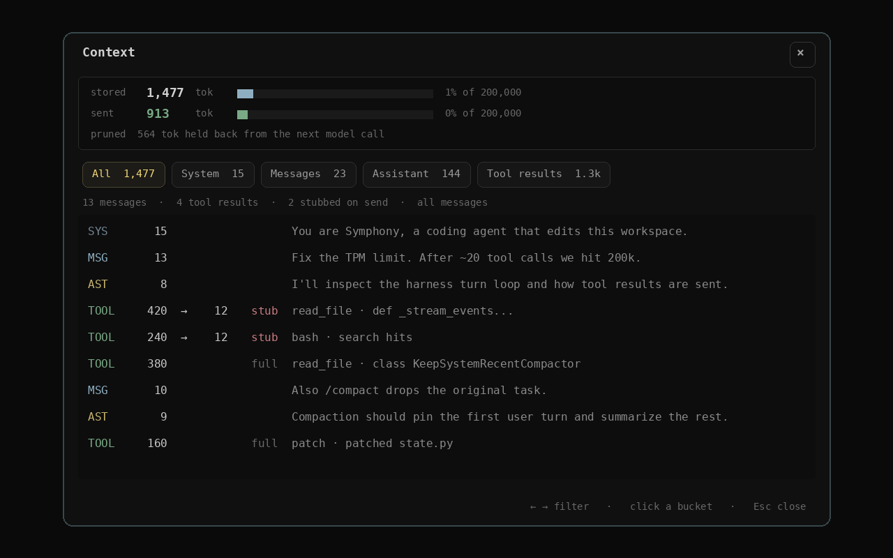

# Sessions

Conversation persistence lives at
`~/.symphony/sessions/<session_id>.jsonl`. Resume with `session_id` in
the library API, or `symphony --resume` in the TUI (interactive picker). `/new`
starts a fresh persisted session.

```sh
uv run --package symphony-code symphony --resume
```

## What is stored

One JSONL file per session (including child agents). Messages append as the run
progresses; compaction currently rewrites the message entries in that file.
Checkpoints are slim status records, not a second copy of the transcript.
Token deltas are not stored. Tool-result stubs replace old bodies in the
**model-facing** copy once the prune budget is hit.

<div align="center">
  
</div>

`/context` breaks down stored vs sent tokens by role.

## Library

`JsonlPersistence` implements the harness `Persistence` protocol. coding_agent
attaches it by default. A bare `CoreHarness` uses `NullPersistence`, so library
harness runs discard state unless you attach a store.
