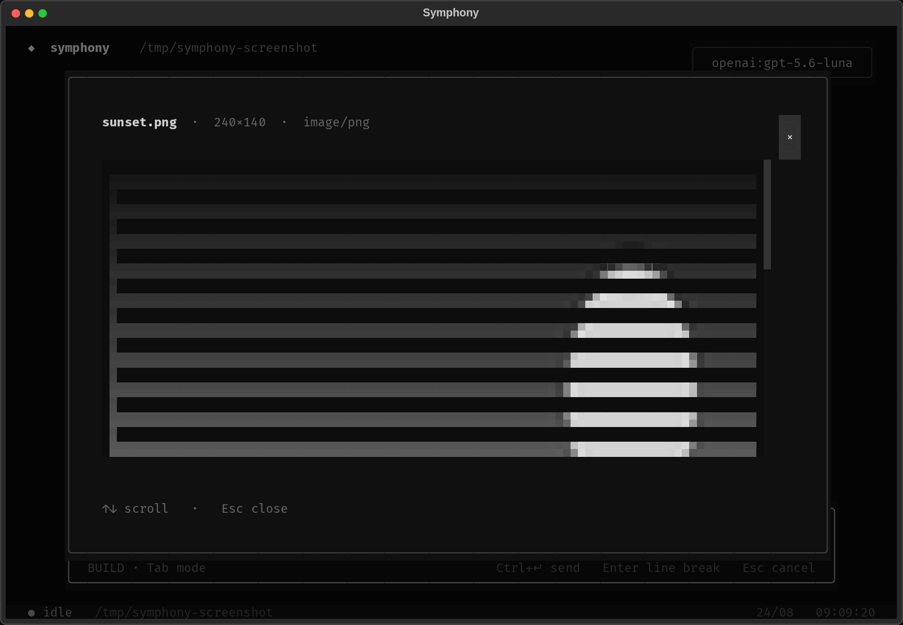

# TUI

The TUI is a conversation surface over the harness event stream. It does not
scrape stdout. Every tool row, token, usage line, and compaction notice is a
control-plane event.

On first launch with no credentials, a provider screen asks which API to use
and for a key. That key is saved to `~/.symphony/.env`. Add more providers
later with `/provider`; `/model` then lists every credentialed catalog.

```sh
uv run --package symphony-code symphony
uv run --package symphony-code symphony --workspace /path/to/project
uv run --package symphony-code symphony --model gemini:gemini-3.7-flash
```


<div align="center">
  
</div>

## Keybindings

| Keys | Action |
| --- | --- |
| `Esc` / `Ctrl+X` | Cancel the in-flight run |
| `Ctrl+L` or `/clear` | Reset the visible transcript |
| `Ctrl+D`, `/quit`, `/exit` | Leave the TUI |
| `Tab` | Toggle build ↔ plan without opening the menu |
| `/` | Slash-command palette |
| `@` | Workspace file search (after whitespace) |

## Run metrics

Completed runs show a compact line such as
`3m 12s (↑1.62M ↓7.03k) · 44 model calls · 56 tool calls`.
The arrows indicate cumulative input and output tokens for the displayed agent's
run; `k` and `M` abbreviate thousands and millions, and `~` marks estimated usage.
Elapsed time covers the run, including tools and approval waits.

Model calls count main-loop turns, excluding retry attempts, compaction, and
learning requests. Tool calls count distinct calls reaching tool dispatch,
including denied or failed calls, rather than streamed argument fragments.
Child transcripts show their own metrics; the parent line does not aggregate
child usage. Context usage remains available in the footer and `/context`.

## Tool transcript

Completed tools fold into an expandable **Explored** widget in batches of 10.
When the run finishes, remaining completed tools
fold too, and expanded batches close. Running tools remain visible. Restored
conversations use the same compact presentation. Completed thoughts fold into
the same widget, retaining only their titles.

Click a summary, or focus it and press Enter or Space, to inspect tool paths,
and commands in event order, without tool output or reasoning bodies. The
Explored label is colored on a transparent background; green
checks mark successful calls, and red accents and a failure count keep errors
visible even when collapsed.

## Build vs plan

**Build** can read, edit, and run. **Plan** is read-only: it inspects the repo
and writes a streamed plan to a task-named file such as
`.symphony/plans/to_build_a_server_plan.md`. Plan mode uses a yellow composer
border. When planning finishes, a modal offers **Build now**. `/plan` opens a
searchable picker of saved workspace plans.

## Composer extras

- `@` after whitespace opens the same selector as model/command pickers. Tab
  or Enter inserts `@path` without sending.
- Drop an image onto the composer (terminals paste the file path) to attach a
  clickable `[Image 1]` chip.
- `generate_image` writes the asset to disk and uses the same chip on the tool
  row.

<div align="center">
  
</div>

## Approvals

Product policy (`coding_agent.approvals`) decides which tools need a prompt;
the TUI only renders the question. Default `approvals.mode` is `ask`. Choose
**Allow once**, **Deny**, or **Always allow**. Always-allow is a **run-level**
override — it applies to the current run and its children, and does not
rewrite `.symphony/config.json`.

## Subagent sessions

Click a Subagent row to open a nested session with the same transcript chrome.
Children run without approval prompts; the parent approval mode is unchanged.

Child tasks run in the background by default. The parent receives a child ID
immediately and can continue independent work. The runtime automatically
delivers child results between model turns. When independent work is done,
it waits for remaining children and lets the parent incorporate their results
before completing the run. No extra model tool calls are needed to wait or poll.
Passing `background: false` to `spawn_agent` explicitly waits for completion.

Press **Ctrl+G** to browse running and finished children, then **Enter** to
inspect one. Child entries remain clickable after tool compaction. The child
screen uses the parent's thought titles, tool widgets, 10-tool/final-completion
folding, and usage footer. **Esc** or **q** returns to the parent without
stopping the child; **Ctrl+X** inside the child screen cancels that child.

Each child has a separate JSONL file under `.symphony/sessions/`, linked to
the parent session. Resuming the
parent restores its child list and transcripts. Closing the app stops its
background children; after an unclean exit, unfinished saved children appear
as **interrupted**. Saved transcripts are inspectable, but opening one does
not automatically restart execution.

<div align="center">
  
</div>

The full command list is on [Slash commands](../reference/slash-commands.md).
